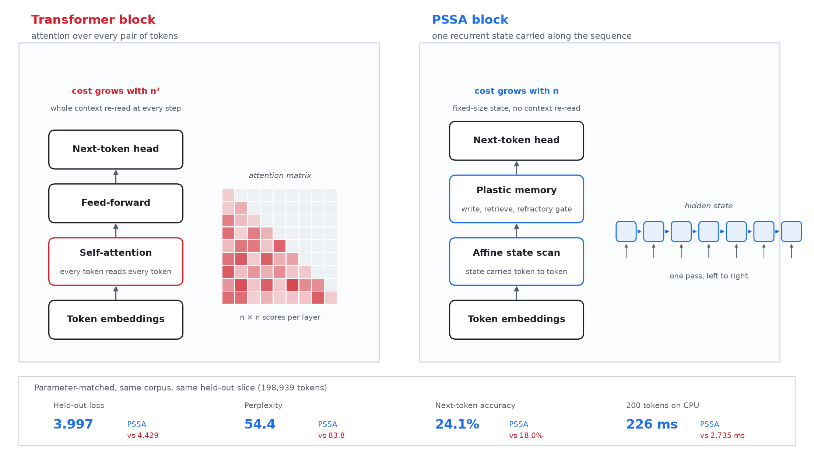
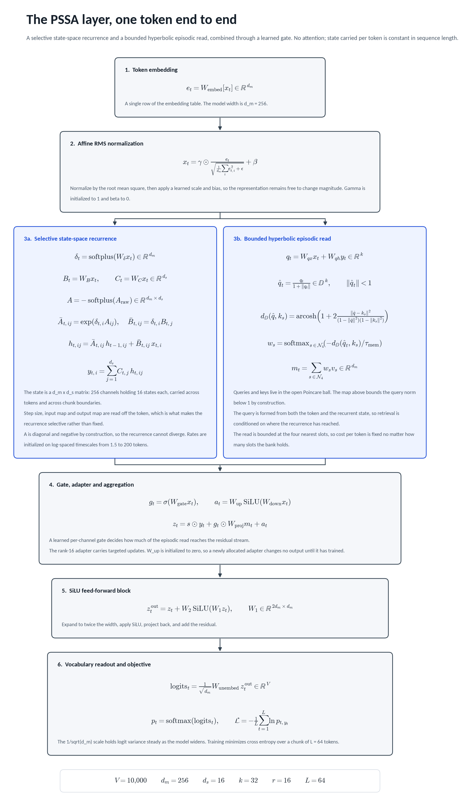
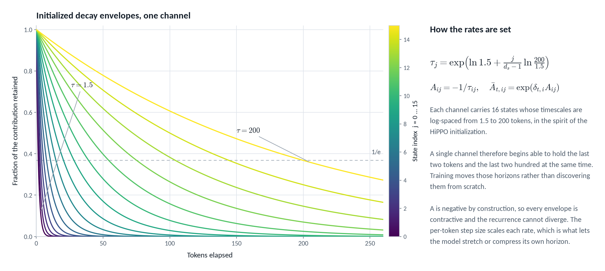
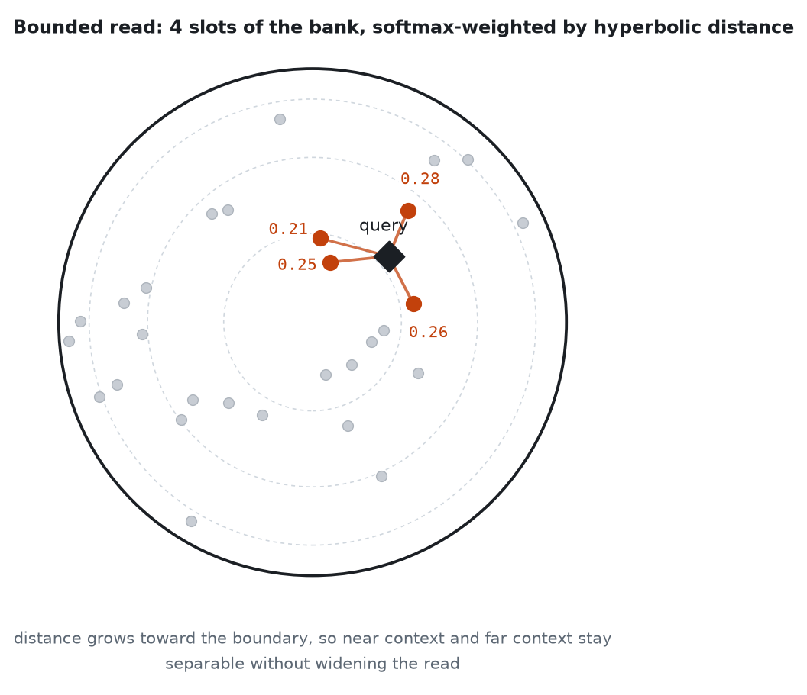
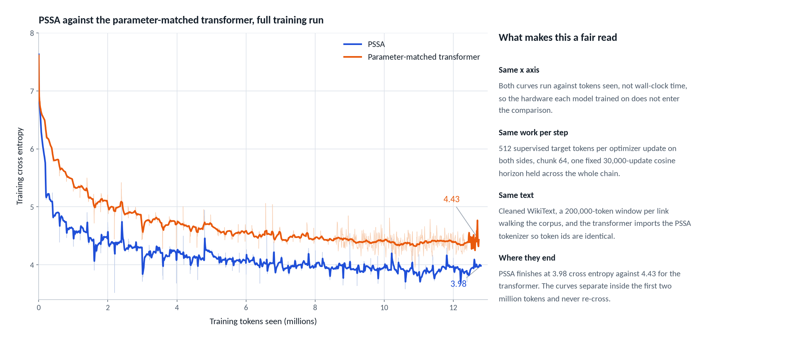
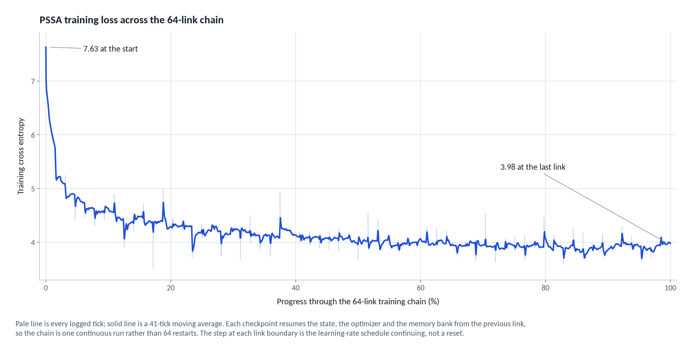
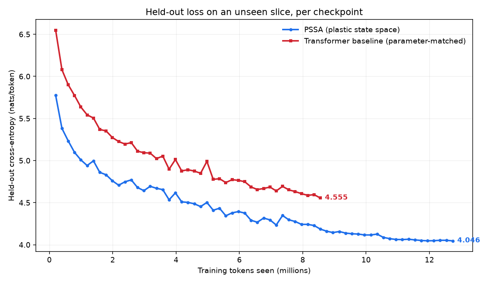
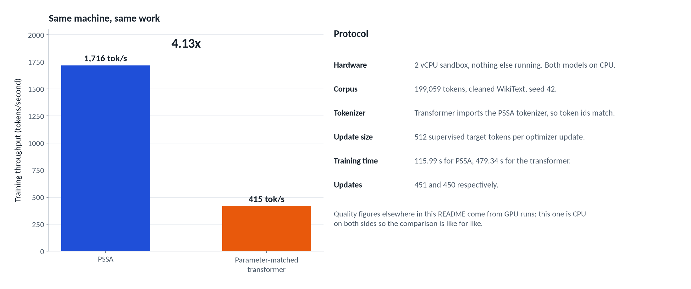
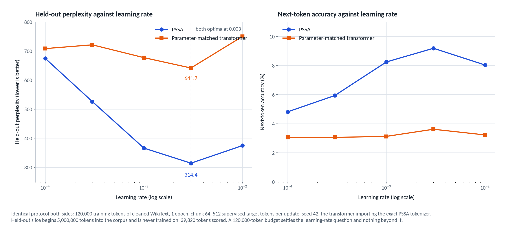

# PSSA: a plastic state-space architecture

[](https://discord.gg/9sqfKeqWYF)

PSSA is a small language model that is not a transformer. It reads text one
token at a time through a recurrent state-space layer, keeps a bank of episodic
memories it can look things up in, and rewrites part of its own weights while it
runs. It is written in Rust from scratch, with no PyTorch, no TensorFlow, and no
ML framework of any kind underneath it.

At matched parameters and on the same corpus, it learns faster than a
transformer and generates text about twelve times quicker on the same CPU.

## Why Rust, and why that is not the point
Not for speed points, and not because the language makes the architecture
better. PSSA needed per-token weight updates, a memory bank written during the
forward pass, and a scalar reference path that every batched kernel could be
differentiated against. Expressing that inside an autograd framework meant
fighting the framework at every step, so the linear algebra is written
directly instead. That made the plastic parts straightforward and the
gradients checkable against a reference to around 3e-8. The architecture is
the claim here. The implementation language is a detail, and a Python port is
welcome.

## How it differs from a transformer



A transformer scores every pair of tokens in the context, so its cost per step
grows with the square of the sequence length and the whole context is re-read at
every step. PSSA carries one fixed-size state along the sequence in a single
left-to-right pass, and looks things up in a memory bank instead of re-reading
the context, so cost grows linearly with length.

## The model



Every token goes through one PSSA layer: a selective state-space recurrence,
a bounded read from an episodic memory bank in hyperbolic space, a learned gate
that decides how much of that read reaches the residual stream, and a SiLU MLP.
The defaults are `d_m = 256` channels, `d_s = 16` states per channel, and a
rank-16 adapter.

### The recurrence

Write `x` for the layer-normalized token embedding. Three projections are read
off the token itself, which is what makes the recurrence selective rather than
fixed:

```
delta = softplus(W_delta x)      per-channel step size,  delta in R^d_m
B     = W_B x                    input map,              B in R^d_s
C     = W_C x                    output map,             C in R^d_s
```

The transition is diagonal, one rate per (channel, state) pair, kept negative by
construction so the recurrence cannot blow up:

```
A = -softplus(A_raw)             A in R^(d_m x d_s)
```

Discretizing that continuous system with step `delta` gives the per-token update.
`h` carries across tokens and across chunk boundaries during training:

```
Abar_ij = exp(delta_i * A_ij)
Bbar_ij = delta_i * B_j

h_ij <- Abar_ij * h_ij + Bbar_ij * x_i
y_i   = sum_j C_j * h_ij
```

`A_raw` is initialized so each channel's 16 rates sit on log-spaced timescales
`tau` from 1.5 to 200 tokens, in the spirit of the HiPPO initialization. A single
channel therefore starts out holding the last two tokens and the last two hundred
at the same time, and training moves those horizons rather than discovering them
from scratch.



This half of the layer is a selective diagonal SSM and claims no novelty; it is
the same family as S4 and Mamba, written out scalar-first so the backward pass
can be checked term by term.

### The memory read

The part that is specific to PSSA is what happens to `y`. A query is formed from
both the current token and the current state, so retrieval is conditioned on
where the recurrence has got to and not only on the token in hand:

```
q  = W_qx x + W_qh y
qh = proj(q)                     diffeomorphic map into the Poincare ball, |qh| < 1
```

The read is bounded at four slots, weighted by a softmax over hyperbolic distance
at temperature `tau_mem`:

```
w = softmax(-d_H(qh, k_s) / tau_mem)   over the 4 nearest slots
m = sum_k w_k * v_k
```



Hyperbolic distance grows toward the boundary of the ball, so slots holding
general context and slots holding one specific episode stay separable without
widening the read. Four slots is a fixed cost per token regardless of how much
the bank holds.

### Gate, adapter, MLP

The read does not join the stream unconditionally. A learned per-channel gate
decides how much of it lands, alongside a low-rank SiLU adapter that carries
targeted updates:

```
g     = sigmoid(W_gate x)
z     = s * y + g (elementwise) W_proj m + adapter(x)
u     = W_2 silu(W_1 z)
z_out = z + u
```

### The write path

Writes are the reason the architecture is called plastic. A slot is inserted when
the incoming state is novel against what the bank already holds, each slot carries
a refractory counter that rate-limits how often it can be overwritten, and fast
plastic updates are folded back into the base transition matrix by a closed-form
ridge regression rather than living in the external store forever:

```
A_base <- A_base + (H^T H + lambda I)^-1 H^T dH
```

The refractory counter is what keeps a stream of contradictory updates from
erasing a slot that repeated evidence has already stabilized, and consolidation is
what stops the bank from being the only place long-range structure is stored.

### What is and is not new here

The recurrence is standard selective-SSM machinery. The claims are the hyperbolic
bounded read conditioned on the recurrent state, the novelty and refractory rules
on writes, and the ridge consolidation step from fast weights into the transition
matrix. Everything is implemented against a scalar reference path that the batched
and parallel implementations are differentiated against on every commit, currently
agreeing to a maximum gradient error around 3e-8 (`cargo run --release --example
twin_check`).

## The result

Two models, same corpus, same tokenizer, same optimizer schedule, same seed,
same number of parameters. One is PSSA, one is a standard transformer. Over
12.7M tokens of cleaned WikiText-103:



PSSA finished at **3.98** training cross-entropy, the transformer at **4.43**.
That is a gap of **0.45 nats**, perplexity 53.7 against 83.7. The transformer
spent its entire 12.7M-token budget to reach a loss PSSA had already passed
around 2M tokens in.

The two curves never cross, and they never touch. Here is the PSSA run on its
own, every logged update across the chain:



29,243 logged updates, 7.63 down to 3.98, with a 41-point moving average drawn
over the raw ticks.

### It holds on text neither model has seen

Training loss only says a model fit the stream it was fed. So both checkpoints
were scored on a 198,939-token slice cut from a part of the corpus neither run
ever touched:



Every checkpoint of both runs, 64 PSSA links and 43 transformer links, scored on
a bounded 9,934-token window of that unseen slice. The curves never cross: PSSA
is ahead from the first link and finishes 0.51 nats lower. The table below is the
final checkpoint of each run on the full slice.

| Held-out slice, 198,939 unseen tokens | PSSA | Transformer |
| --- | --- | --- |
| Cross-entropy | **3.997** | 4.429 |
| Perplexity | **54.4** | 83.8 |
| Next-token accuracy | **24.1%** | 18.0% |

The held-out gap, 0.43 nats, is essentially the training gap. PSSA is not
memorizing harder, it is generalizing better.

### And it is much faster to run



Fixed work on the same 2 vCPU machine, 199,059 tokens at 512 tokens per update:
1,716 tokens per second against 415, so 4.13x. Both models were timed on CPU.



Both architectures put their optimum at the same learning rate, 0.003, so
neither run is winning on a tuning advantage. The sweep is a short probe on a
120,000-token slice, a settings check rather than a final number.

Generating 200 tokens on the same CPU, same prompt, same sampler:

| | PSSA | Transformer |
| --- | --- | --- |
| 200 tokens | **226 ms** | 2,735 ms |
| Relative | **12x faster** | baseline |

A recurrent model carries a fixed-size state, so the cost of each new token does
not grow with the length of what came before. A transformer re-reads its whole
context every step.

## What is actually different about it

- **A recurrent state-space core.** Learned continuous state matrices carry
  information forward in a fixed-size state, instead of attention over the full
  context window.
- **An episodic memory bank.** 512 slots with hyperbolic (Poincare-style)
  retrieval and bounded top-4 search, written to and read from during the run.
- **Plastic weights.** Fast updates reinforce what works, novelty drives growth,
  and a refractory gate rate-limits overwrites so repeated contradictory input
  does less damage.
- **Closed-form consolidation.** A ridge-regression step folds the fast plastic
  updates back into the base transition matrix, the way sleep consolidates a
  day's learning.
- **No framework.** Hand-written linear algebra in Rust, with a CUDA path for
  training and a scalar CPU reference that every gradient is checked against
  (max gradient difference 2.98e-8).

## What this is not

Being straight about the scale, because the numbers above are easy to
over-read:

- These are **1.5M-parameter models** on 12.7M tokens. That is a research
  prototype, not a competitor to anything you have heard of.
- Text quality at this scale is poor for both models. PSSA emits "a barget of
  the Prian Academy", the transformer "a material circulation of the United
  States". The comparison is about learning efficiency, not fluency.
- The speed comparison is CPU-to-CPU, which is fair. The training throughput
  numbers further down are **not** hardware-matched and should not be read as an
  architecture result.
- Two experiments are still unmeasured: retention of earlier skills after a
  corpus switch, and whether ablating the memory bank changes the loss.

## Try it

```bash
git clone https://github.com/Sparticle62ops/pssa.git
cd pssa
cargo build --release
./target/release/oxide_ai_pssa
```

Running it with no arguments gives you a home screen listing every command plus
any checkpoint and corpus it finds in the working directory.

## Where the project needs help

### Compute

The whole result above was trained on a free hosted notebook with a single
entry-level GPU, in 200,000-token links, because a session gets cut after a few
hours. Every interesting question left, whether the gap holds at 10x or 100x
these parameters, whether the memory bank matters at scale, how it does against
a modern recurrent baseline, needs one thing: a GPU with real VRAM and
allocations measured in days instead of hours. Anything meaningfully above the
entry-level card this ran on changes what can be asked.

If you have compute to grant, or you work somewhere that does, that is the
single highest-leverage thing anyone can offer this project.

### Sponsorship

Sponsorship funds compute and nothing else. In return you get named here and in
the write-up of any result your hardware made possible. Get in touch before
sending anything so the details can be agreed.

### Contributing

Issues and pull requests are welcome. The parts most in need of hands: kernel
performance, a modern recurrent baseline to compare against, and evaluation
beyond next-token loss. Validate any branch with `cargo test --release` before
opening a PR.

### Contact

Sparticle62@proton.me

### Donate

Solana: `4XPZ9uAa2BMoth6msoHRxTWL4mUrMfq3LGrxbAGja96h`

---

# Setup and codebase

Everything below is for running, training, and working on the project.

## Requirements

- Rust toolchain with Edition 2024 support, including Cargo.
- Network access only when using an HTTP/HTTPS dataset or a Hugging Face dataset.
- Enough memory and disk for larger corpora and serialized models.
- Optional: a CUDA device for the GPU training path. The CPU path is the
  reference and always available.

Direct runtime dependencies are [`ureq`](https://crates.io/crates/ureq) for
dataset downloads and [`tokenizers`](https://crates.io/crates/tokenizers) for
byte-level BPE. A GPU is optional. Built with `--features cuda` the dense
matrix work dispatches through cuBLAS with a device-resident weight cache; a
WebGPU adapter is used for the same stages when CUDA is unavailable, and
software adapters are refused because they are slower than the CPU path.
Everything falls back to the CPU implementation with no feature flags.

## How the comparison was run

### How the two runs were matched

Both chains ran 64 links of 200,000 encoded tokens, each link resuming from the
previous checkpoint, so the learning-rate schedule and optimizer state continue
across the whole run instead of restarting per link.

- Identical corpus: one `clean-wikitext` pass over WikiText-103, reused byte for byte.
- Identical token IDs: the baseline pins `--tokenizer-from` to the PSSA chain's
  own checkpoint, so neither model sees a different vocabulary.
- Identical optimization: 30,000-update cosine horizon, no warm-up restart, 512
  supervised target tokens per update, seed 42.
- PSSA: latent 256, recurrent state 16, 512 memory slots, key width 32, vocab 2,048.
- Baseline: 1,541,120 parameters, 1 layer, width 256, 4 heads, FFN 448, vocab 2,048.

Matching the optimizer schedule cuts one way and not the other: neither model
received tuning the other did not, but a schedule that suits PSSA is not
guaranteed to be the transformer's best, so part of the gap could be an
undertrained baseline rather than the architecture. A per-model learning-rate
sweep is running now, both models swept over the same grid on the same token
budget, and the best-against-best numbers will be posted here when it
finishes, whichever way they come out.

### Per-token learning curve

End-of-link training cross-entropy:

| Link | Tokens seen | PSSA | Transformer |
| --- | --- | --- | --- |
| ck01 | 200,000 | 5.733 | 6.461 |
| ck05 | 1,000,000 | 4.617 | 5.467 |
| ck10 | 2,000,000 | 4.447 | 5.082 |
| ck15 | 3,000,000 | 4.292 | 4.858 |
| ck20 | 4,000,000 | 4.185 | 4.704 |
| ck25 | 5,000,000 | 4.221 | 4.704 |
| ck30 | 6,000,000 | 4.070 | 4.561 |
| ck35 | 7,000,000 | 4.039 | 4.523 |
| ck37 | 7,400,000 | 3.960 | 4.465 |
| ck44 | 8,800,000 | 4.004 | 4.480 |
| ck48 | 9,600,000 | 3.937 | 4.415 |
| ck52 | 10,400,000 | 3.846 | 4.344 |
| ck56 | 11,200,000 | 3.887 | 4.375 |
| ck60 | 12,000,000 | 3.972 | 4.418 |
| ck64 | 12,800,000 | 3.982 | 4.428 |

The baseline's first session was cut at link 43 by the notebook session limit
and its loss CSV did not survive, so links 1 to 43 are read back from that
session's own run log instead. The chain resumed from `ck43` in a second session
and finished all 64 links, and both curves above now cover the full run.

### Throughput is not hardware-matched

The headline training rates come from different machines and say nothing on
their own: PSSA trained on a Kaggle T4 at roughly 900 tokens/second, while the
baseline is CPU-only because `train-transformer` has no GPU path, and held 212
tokens/second there.
For a comparison that means something, both models were trained on the same
CPU-only box, a 2-vCPU container with no GPU, over the same 199,059-token
slice of the cleaned corpus with seed 42 and identical update counts. PSSA
held 1,716 tokens/second against the baseline's 415, so 4.1x on matched
hardware and matched work. An earlier measurement on Kaggle's CPU, before the
scan parallelization, put the same pair at 375 against 212.
The loss comparison above is unaffected either way, since it is matched on
tokens and updates rather than on time.

### What these numbers are, and are not

The losses are end-of-link training cross-entropy on the stream being fit, not
held-out evaluation. For a held-out comparison on an unseen slice, use the
`compare` command described in [docs/COMPARISON.md](docs/COMPARISON.md).
Generation quality at this scale is poor for both models: PSSA emits "a barget
of the Prian Academy", the baseline "a material circulation of the United
States".

Two experiments are not yet measured: retention of earlier skills after a
corpus switch, and whether ablating the 512 memory slots changes loss.

### Reproducing

```bash
bash kaggle/kaggle_continue.sh              # the PSSA chain
bash kaggle/kaggle_transformer_baseline.sh  # the parameter-matched baseline
```

Both read `TOTAL`, `WINDOW` and `FRESH` from the environment and write
`--loss-csv`, so the curve survives a cut session.

## CLI Reference

General form:

```text
oxide_ai_pssa <COMMAND> [OPTIONS]
```

Commands:

| Command | Purpose |
| --- | --- |
| `train [source]` | Fit a PSSA checkpoint on a text corpus and write a `.pssa` file. |
| `train-transformer [source]` | Fit the CPU decoder-only baseline and write a `.trfm` file. |
| `generate <prompt>` / `generate-transformer` | Continue a prompt with a trained checkpoint. |
| `chat [source]` | Interactive prompt loop against a checkpoint. `repl` remains a hidden alias. |
| `score [source]` / `score-transformer` | Score a checkpoint on held-out text as JSON. `evaluate` remains a hidden alias. |
| `throughput [source]` | Measure frozen-model scoring tokens/sec. |
| `status` | Checkpoints and corpora in the working directory. Takes no options. |
| `download <repo>` | Pull a Hugging Face dataset to a local file. |
| `clean-wikitext INPUT -o OUTPUT` | Stream-clean a raw WikiText file into a new UTF-8 corpus. |
| `benchmark` | End-to-end smoke test or feature benchmark. |
| `compare` | Replay an existing PSSA chain with a token/update-matched transformer and score both on held-out tokens. |
| `tui` | Open the dashboard and local checkpoint chat, or view piped training output. |
| `gpu-probe` | Check whether a WebGPU compute device is usable. |
| `help` | Print command and option help, including examples. |

The training display uses cursor updates only on a real terminal. For a plain,
parseable log (recommended for Kaggle or a pipe), pass `--no-tui`; the output
still includes loss, a short moving average, speed, ETA, update counts, learning
rate, memory occupancy, and checkpoint events. To view a piped log interactively:

```bash
oxide_ai_pssa train data/downloaded.txt -o chain/ck01.pssa --max-tokens 200000 -e 1 --no-tui \\
  | oxide_ai_pssa tui --chain chain
```

### Project dashboard extras (TUI)

`Ctrl+K` opens the command palette; `?` (or `F1` while typing) opens key help.
Tab to Kaggle launch/log monitoring, the read-only plastic memory inspector,
past runs and scoring, or the one-key matched benchmark. In inference, `/ab a PATH`
and `/ab b PATH` compare PSSA/transformer replies side by side. See
[the extras guide](docs/TUI-EXTRAS.md) for setup, telemetry limits, alerts, and the
[VHS GIF recording tape](docs/tui-demo.tape).

### Local inference chat (TUI)

Run `oxide_ai_pssa tui` in a terminal (or run with no arguments on a TTY), then
press **Tab** to reach **inference**. Existing `chat`/`generate` CLI commands and
`--no-tui` logging are unchanged. Non-TTY `tui` output remains a plain log passthrough.

- `/model` lists PSSA checkpoints in `--chain DIR` and `data`; `/model PATH`
  selects one. Paths may contain spaces, without shell quotes. Checkpoints and
  their embedded tokenizers are loaded read-only in a worker, not the render loop.
- Type a message and press **Enter**. Tokens stream into the conversation with
  an actual token count and live average tokens/sec (including load/prefill time).
  **Esc** or `/stop` cancels; partial replies are retained. Checkpoint loading is
  not interruptible, but prefill/generation check cancellation between tokens.
- `/new`, `/chats`, `/open ID`, `/rename NAME`, `/delete ID` manage conversations.
  Repeat `/delete ID` to confirm. JSON documents in `chats/` contain the model
  path, messages, system prompt and settings; use `tui --chats-dir DIR` to change
  the location. Writes are atomic; files are owner-only on Unix. These local
  files include attachment contents—treat them as private. No chat is uploaded.
- `/temp 0.7`, `/top-p 0.85`, `/top-k 24`, `/max-tokens 64`, and
  `/repetition-penalty 1.25` change sampling controls; `/system TEXT` sets the
  system prompt (empty clears it). Max output is 1–4096 tokens. Context is a
  plain `System`/`User`/`Assistant` transcript, not an instruction-tuned chat
  template: the quality depends on the trained checkpoint. Overlong context
  (>256 KiB) is rejected rather than silently discarding history.
- `/attach PATH` inserts a UTF-8 text file into the **next** message (64 KiB total
  pending attachments); `/detach` clears them. Images, PDFs, audio, binaries and
  other non-text files display “not supported by this model yet”.
- **PgUp/PgDn** scroll through wrapped history; **End** follows the latest reply.
  `/copy` requests terminal clipboard access via OSC 52 (the terminal must permit
  it). `/help` lists chat commands; **F1** opens the shared keyboard help.
  **Ctrl+U** clears input; `//text` sends a leading slash. In inference, `q` and
  `?` are text and Esc stops, not quits; **Ctrl+C** quits, or Tab to another tab
  and use the existing `q` key. Outside text input, **?** also opens help.

The tab order is **monitor, chain, model, feed, inference, setup, HF login,
Kaggle, memory, runs, benchmark**. The
[training setup wizard](docs/training-setup.md) launches a separate trainer
and returns to the monitor; **Tab** switches tabs even while editing a field.
**Ctrl+K** opens the command palette. All tabs share one **F1 / ?** keyboard
reference; narrow terminals show the selected tab instead of clipping the tab bar.

Optional local speech capture (Linux/ALSA) is built with `cargo build --release
--features speech`. Install an existing local **whisper.cpp** `whisper-cli` (or
`main`) and **arecord**, then set `OXIDE_WHISPER_BIN` and `OXIDE_WHISPER_MODEL` to
the binary and ggml model paths. Without overrides the app searches PATH for
`whisper-cli`/`main` and `models/ggml-{base.en,base,tiny.en}.bin` for a local model.
`/speech` records ten seconds, transcribes locally, deletes temporary audio, and
inserts text in the input box for review; it never auto-sends. Esc cancels the
child process. Missing tools/model or a default build show enablement guidance.
No models are downloaded and the default build has **no audio dependencies**.

Options:

| Option | Default | Applies to | Description |
| --- | --- | --- | --- |
| `-d, --data <source>` | `data/downloaded.txt` when present, otherwise `science` | `train`, `train-transformer`, `chat`, `score`, `score-transformer`, `throughput` | Dataset source, or a comma-separated list. |
| `-m, --model <path>` | `data/model.pssa` (or `.trfm` for baseline commands) | `chat`, `generate`, `generate-transformer`, `score`, `score-transformer`, `throughput` | Checkpoint to load. |
| `-o, --out <path>` | Command-specific; required for `clean-wikitext` | `train`, `train-transformer`, `download`, `clean-wikitext`, `benchmark` | Output checkpoint, dataset, or benchmark path. Cleaning requires a new file. |
| `-p, --prompt <text>` | empty | `generate`, `generate-transformer` | Prompt text. Required for generation. |
| `-e, --epochs <n>` | `4` | `train`, `train-transformer` | Training epochs. |
| `-t, --temp, --temperature <float>` | `0.70` | `chat`, `generate`, `generate-transformer` | Sampling temperature. |
| `--max-new-tokens <n>` | `64` (maximum 100,000) | `generate`, `generate-transformer` | Generation length cap. |
| `--latent <n>` | `256` | `train` | PSSA latent dimension. |
| `--depth <n>` | `1` | `train` | Continuous PSSA blocks; stacked models run on CPU. |
| `--state <n>` | `16` | `train` | PSSA recurrent state dimension. |
| `--key <n>` | `32` | `train` | PSSA memory-key dimension. |
| `--memory <n>` | `512` | `train` | PSSA memory-bank capacity. |
| `--batch-size <n>` | `1` | `train` | Independent PSSA document lanes. |
| `--chunk <n>` | `64` | `train`, `train-transformer` | Sequence chunk length. |
| `--lr <float>` | `1e-3` | `train`, `train-transformer` | Base learning rate. |
| `--accumulate <n>` | `8` | `train`, `train-transformer` | Chunks per optimizer update. |
| `--warmup-steps <n>` | `0` | `train`, `train-transformer` | Linear warm-up before cosine decay. |
| `--total-updates <n>` | unset | `train`, `train-transformer` | Fixed whole-run schedule horizon. |
| `--seed <n>` | `42` | `train`, `train-transformer` | Initialization seed. |
| `--tokenizer <bpe\|word>` | `bpe` | `train`, `train-transformer` | Tokenizer family. |
| `--vocab-size <n>` | `2048` | `train`, `train-transformer` | BPE vocabulary maximum. |
| `--tokenizer-from <path>` | unset | `train-transformer` | Import the exact tokenizer from a PSSA checkpoint. |
| `--max-tokens <n>` | unset | `train`, `train-transformer` | Global cap across input documents, not per document; scoring commands use it for a held-out slice. |
| `--skip-tokens <n>` | `0` | `train`, `train-transformer` | Skip this many tokens before training starts; scoring commands use it for a held-out slice. |
| `--resume <path>` | unset | `train`, `train-transformer` | Continue from an existing checkpoint. |
| `--loss-csv <path>` / `--loss-every <n>` | unset / `10000` | `train`, `train-transformer` | Append target-token training curves at update boundaries. |
| `--tokens-seen <n>` | unset | `train`, `train-transformer` | Offset for a new loss CSV on resume. |
| `--no-tui` | off | `train`, `train-transformer` | Disable cursor updates and emit rate-limited plain progress lines. |
| `--hf-dataset <owner/name>` | unset | `train` | Train from a paged, disk-cached Hugging Face dataset instead of a local source. |
| `--hf-config <config>` | auto | `train` | Dataset configuration; required when the repository has multiple configurations. |
| `--hf-split <split>` / `--hf-field <field>` | `train` / `text` | `train` | Split and text column (dotted nested fields supported). |
| `--skip-tokens <n>` / `--max-tokens <n>` | `0` / unset | `score`, `score-transformer`, `throughput` | Select a strict held-out slice; scoring never wraps at EOF. |

Positional arguments and long/short options can be mixed:

```bash
cargo run --release -- train data/downloaded.txt -e 2 -o data/experiment.pssa
cargo run --release -- train --data data/downloaded.txt --epochs 2 --out data/experiment.pssa
```

### Chat commands

Inside the REPL:

- `/exit` or `quit` exits the process.
- `/info` prints the loaded model path, total memory slot count, and adapter count.
- `/temp <value>` changes the sampling temperature for later turns; it must be finite and at least zero.

## Training over a long corpus

`--skip-tokens`, `--max-tokens` and `--resume` together let a long corpus be trained as a chain of short runs, so a single run never has to survive a session limit. If a window crosses EOF, selection wraps to the beginning of the corpus. Each link trains its own window and hands its optimizer state to the next:

```bash
cargo run --release -- train data/downloaded.txt -e 1 \
  --skip-tokens 0      --max-tokens 200000 -o chain/ck01.pssa
cargo run --release -- train data/downloaded.txt -e 1 \
  --skip-tokens 200000 --max-tokens 200000 --resume chain/ck01.pssa -o chain/ck02.pssa
```

`kaggle/kaggle_continue.sh` drives this pattern end to end: it sets a window size and a link count, walks the corpus offset by offset, and resumes each link from the previous checkpoint. `status` then reports every checkpoint in the chain with its shape and optimizer step count.

## Dataset Sources

`DatasetManager` accepts one or more comma-separated sources:

```bash
cargo run --release -- train science                       # built-in reference corpus
cargo run --release -- train data/downloaded.txt           # local text file
cargo run --release -- train data/                         # every readable file in a directory
cargo run --release -- train https://example.org/corpus.txt
cargo run --release -- train hf:owner/dataset              # Hugging Face repository
cargo run --release -- train science,data/downloaded.txt   # multiple sources
```

Local files and directories are read directly; HTTP(S) URLs and explicit `hf:owner/dataset`
sources are downloaded. Structured responses are reduced using common fields such as
`text`, `content`, `article`, `story`, `instruction`, `output`, `sentence`, and `summary`;
structured responses without a supported text field are rejected.

Byte-level BPE keeps exact UTF-8 case, whitespace, punctuation, and line endings, and has a complete 256-byte fallback alphabet, so valid UTF-8 never collapses to `<unk>`. The previous lowercase word splitter, including its 10,000-word cap and `<unk>` behavior, is available only with `--tokenizer word`.

Download a Hugging Face dataset into a local text file:

```bash
cargo run --release -- download wikimedia/wikipedia --out data/downloaded.txt
```

### Hugging Face training and live feed

```bash
oxide_ai_pssa train --hf-dataset Salesforce/wikitext \
  --hf-config wikitext-103-v1 --hf-split train --hf-field text \
  --max-tokens 200000 -e 1 --no-tui | oxide_ai_pssa tui
```

Use **Tab** to open **feed**: it shows the dataset, completed selected-window rows,
trained tokens, and a short decoded preview sliding into a token-ID shredder.
The displayed IDs are actual input tokens from the latest reported training chunk;
with batching, the preview is the last lane in that update. Row counts include
repeated epochs/windows, and the selected row number is after skip/cap selection,
not a global Hugging Face row ID. Older logs and local training still work without
sample metadata. The animation is cosmetic and runs only in the log reader.

HF downloads use the datasets-server rows API, streaming pages to an atomic disk
cache before the existing in-memory tokenizer/trainer reads the corpus. This is
not online/infinite-dataset training: `--max-tokens` caps training, not the download.
Set `OXIDE_PSSA_HF_CACHE` to a writable cache directory (for example
`/kaggle/working/oxide-hf-cache` on Kaggle, with Internet enabled); otherwise the
cache lives under `$XDG_CACHE_HOME/oxide-ai-pssa/huggingface` or
`~/.cache/oxide-ai-pssa/huggingface`. Cached data can be reused offline; delete its
cache file to refresh it. Choose a configuration explicitly when discovery reports
multiple choices.

For private/gated datasets, open **HF login** with Tab in `oxide_ai_pssa tui`.
Enter a read token (masked) and press **Enter**: the app verifies the account with
HF's `whoami-v2` API and atomically saves `~/.cache/huggingface/token` with mode
`0600`. Existing `HF_TOKEN` credentials take precedence over that file on startup;
plain CLI downloads use the same credentials as a Bearer header. No token is
shown in logs or errors. **Esc** clears entry; **Ctrl+L** logs out and removes the
saved file. Explicit login/logout also applies to subsequently wizard-launched
trainers, without passing tokens in command arguments. Already-running trainers
keep their credentials. Also unset `HF_TOKEN` in your parent shell to sign out
future independently launched CLI runs. Login does not grant gated access:
request/accept access on the dataset's Hugging Face page and wait for approval.
Logout does not remove already downloaded dataset caches.

HF runs add percent-encoded `feed_*` fields to the existing throttled progress
lines (at most every five seconds when piped, plus first/final updates). These
include a short sample of dataset content; treat saved logs accordingly. Local
runs do not add these fields. Do not combine `--hf-dataset` with a positional
source or `--data`.

Network downloads are not validated or curated by Oxide AI. Review licensing, privacy, and content before training on an external corpus.

### Cleaning WikiText raw corpora

Clean extracted `wikitext-103-raw` text **before a fresh training run**:

```bash
./target/release/oxide_ai_pssa clean-wikitext wiki.train.raw --out data/wikitext-clean.txt
./target/release/oxide_ai_pssa train data/wikitext-clean.txt -o data/model.pssa
# Also available: oxide_ai_pssa help clean-wikitext
```

The same command can be used in Kaggle after extracting text from Parquet; it
accepts a local UTF-8 text file, not Parquet itself. `-o` and `--out` are aliases.
The output path is required and must not already exist (including the input
path or a link to it). This protects the original corpus; choose a new output
name for another run. Read, UTF-8, and write failures exit nonzero through the
normal CLI error path, with partial output removed when possible.

The pass:

- Joins `@-@`, `@.@`, and `@,@` to adjacent text: `guest @-@ starring` →
  `guest-starring`, `52 @.@ 9` → `52.9`, `500 @,@ 000` → `500,000`.
- Drops balanced heading lines such as `= Title =` and `= = Section = =`.
- Removes `<unk>` and collapses remaining inline whitespace to single spaces.
- Removes spaces before `.`, `,`, `)` and after `(`; trims each line.
- Retains at most one consecutive blank line, including at the start/end.
  Removing a heading does not introduce a blank line.
- Writes LF line endings, including a newline on the last retained line.

`oxide_ai_pssa::dataset::clean_wikitext(reader, writer)` is the reusable library
API (`BufRead` / `Write`, returning `std::io::Result<()>`). The CLI uses buffered
file I/O, and the cleaner retains only its input/output line buffers: memory is
proportional to the longest line, not the corpus size. Library callers using a
buffered writer must flush it themselves; the CLI explicitly checks the flush.
No new dependencies are required.

Cleaning is opt-in: existing loaders, tokenizers, training commands, and
`kaggle/kaggle_continue.sh` are unchanged. **Do not switch an in-flight resume
chain to a cleaned corpus**: cleaning changes token IDs/counts and the meaning
of `--skip-tokens` offsets. Prepare and consistently reuse one cleaned corpus
for a new chain instead.

## Training Pipeline

The `train` command performs two phases:

1. **Continuous recurrent ingestion:** token transitions are processed through the PSSA layer. The model updates state, memory, adapters, and routing behavior with a cosine learning-rate schedule.
2. **Adapter consolidation:** after each epoch, the plastic adapter's fast coefficients are folded into its consolidated coefficients with the configured EMA rate.

Defaults are latent 256, recurrent state 16, memory-key 32, memory capacity 512, chunk length 64, learning rate 1e-3, 8 chunks per update, and seed 42. The resulting binary holds weights, configuration, memory, adapters, and optimizer state. It is not an interchange format for other ML frameworks and should be loaded through `PSSALayer::import_from_pssa_bytes`.

## Checkpoint compatibility

New saves use **V7**: the full V6 training/resume payload plus a bounded, length-prefixed standard tokenizer JSON. A V7 BPE checkpoint is self-contained and restores its exact ordered vocabulary without access to the training or evaluation corpus. `generate` and `chat` reject `--data` for V7 BPE because retraining a tokenizer on external data would not validate provenance. V7 word checkpoints and V6 checkpoints retain the legacy optional `--data` exact-vocabulary comparison. Checked V5 artifacts remain inference-only and require `--data` because they never contained tokenizer provenance.

## Inference

Generation is autoregressive and uses temperature 0.70, a top-24 candidate limit followed by top-p 0.85 filtering, a 1.25 repetition penalty over a recent 64-token window, immediate self-transition suppression, `<unk>` suppression, and a default cap of 64 new tokens, ending early after two generated periods.

V7 BPE inference restores the exact embedded tokenizer and never rebuilds it from a selected dataset. Evaluation supplies its data only as held-out text to the restored tokenizer.

## Benchmark

```bash
cargo run --release -- benchmark
```

The suite exercises synthetic streams for contradictory facts, MQAR-style distractors, burst repetition, model serialization, and short generation prompts. It prints milestone results, is not wired into Cargo's test harness, and is not a quality evaluation on general language tasks.

## Project Layout

| Path | Responsibility |
| --- | --- |
| `src/main.rs` | Binary entry point; forwards process arguments to the CLI. |
| `src/cli.rs` | Argument parsing, home screen, training, chat, generation, evaluation, status, download, and benchmark orchestration. |
| `src/ui.rs` | Terminal presentation: logo, panels, spinners, progress bars, ANSI-aware width handling. |
| `src/dataset.rs` | Tokenization, vocabulary construction, built-in corpora, local and remote loading, streaming WikiText cleaning. |
| `src/pssa.rs` | PSSA layer, forward pass, plastic learning, consolidation, and `.pssa` serialization. |
| `src/checkpoint.rs` | Checkpoint format versions, resume payloads, and import/export validation. |
| `src/inference.rs` | Autoregressive sampling and generation constraints. |
| `src/backend.rs` | GEMM dispatch, CPU reference kernels, and the WebGPU device probe. |
| `src/memory.rs` | Fixed-capacity hyperbolic memory bank and retrieval/update logic. |
| `src/adapter.rs` | Low-rank modular adapter projections and updates. |
| `src/defense.rs` | Refractory rate-limiter primitives for stable updates and overwrite defense. |
| `src/linalg.rs` | Small allocation-conscious vector, matrix, math, and deterministic RNG utilities. |
| `src/diagnostics.rs` | CLI banner formatting. |
| `kaggle/` | Chained-training driver for long corpora on a hosted notebook. |
| `data/downloaded.txt` | Checked-in corpus used as the default when present. |
| `data/model.pssa` | Checked-in serialized model artifact. |

## Development

```bash
cargo fmt --all -- --check
cargo clippy --release --all-targets
cargo test --release
```

Integration tests live in `tests/`: `allocations.rs`, `bpe_repair.rs`, `checkpoint_repair.rs`, `core_repair.rs`, `linalg.rs`, and `runtime_repair.rs`, with shared artifacts under `tests/fixtures/`. They cover tokenizer round trips, checkpoint import/export across versions, linear-algebra kernels, allocation behavior, and CLI runtime output. Clippy is clean of errors; a number of style warnings in the numeric kernels are left in place deliberately, since rewriting indexed loops there would churn code the gradient tests pin down.

## Limitations

- CPU-oriented prototype with hand-written linear algebra. `gpu-probe` verifies a WebGPU device and a GEMM against the CPU reference, but training and inference still run the layer math on the CPU.
- The CLI parser is intentionally minimal: no shell-style quoting, and little validation beyond numeric parsing.
- A missing or unreadable dataset silently falls back to the built-in science corpus in several loading paths.
- Model and tokenizer vocabularies must remain compatible; a size warning does not repair a mismatch.
- Model shape cannot change across a resume chain: latent, state, key, memory and vocabulary must match the checkpoint being resumed.
- Downloaded content can be large and may contain JSON, malformed text, or data unsuitable for training.
- The REPL temperature command changes the active sampling temperature for later turns.
- Benchmark output is milestone-oriented and does not measure perplexity, factuality, latency, or safety.
- Serialized `.pssa` files are project-specific binary artifacts without version migration tooling.

## License

See [LICENSE](LICENSE) for the project license.
