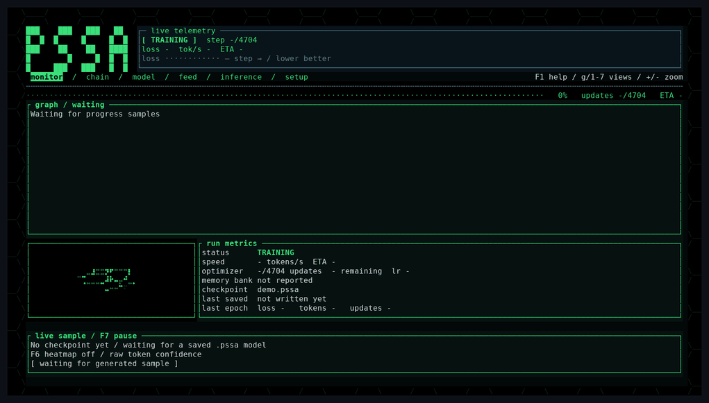
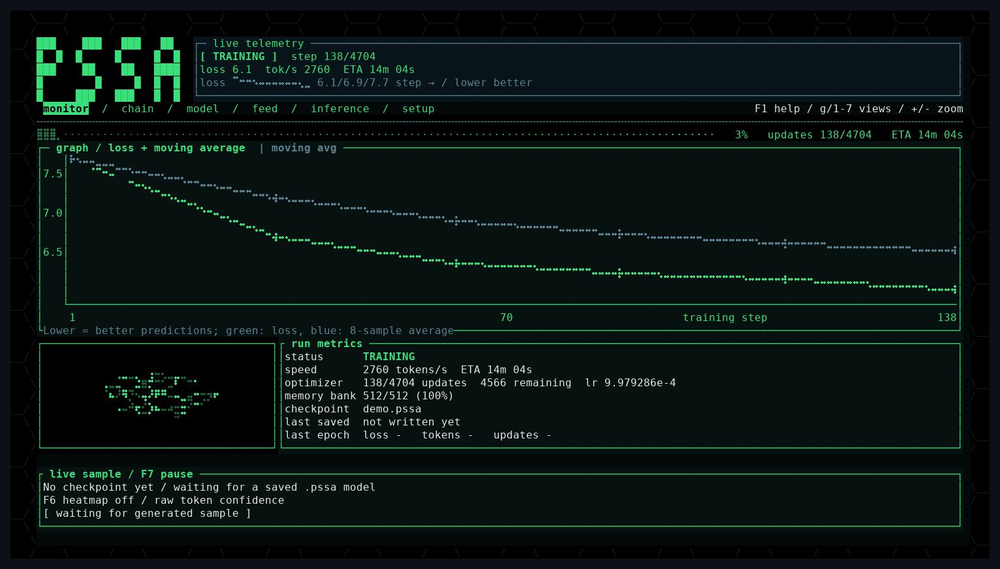
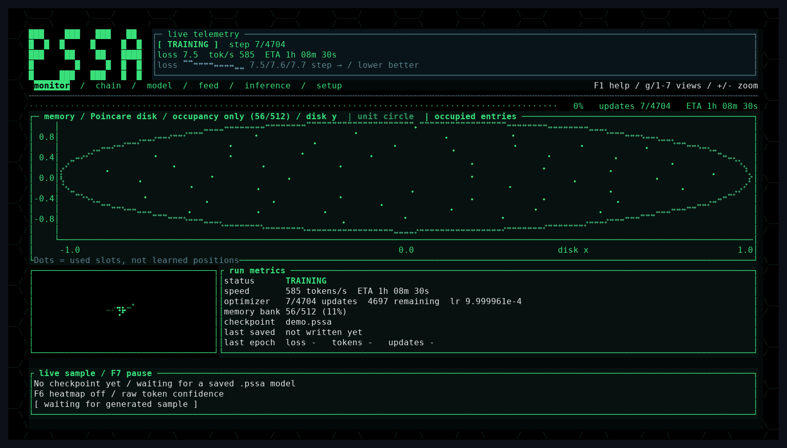
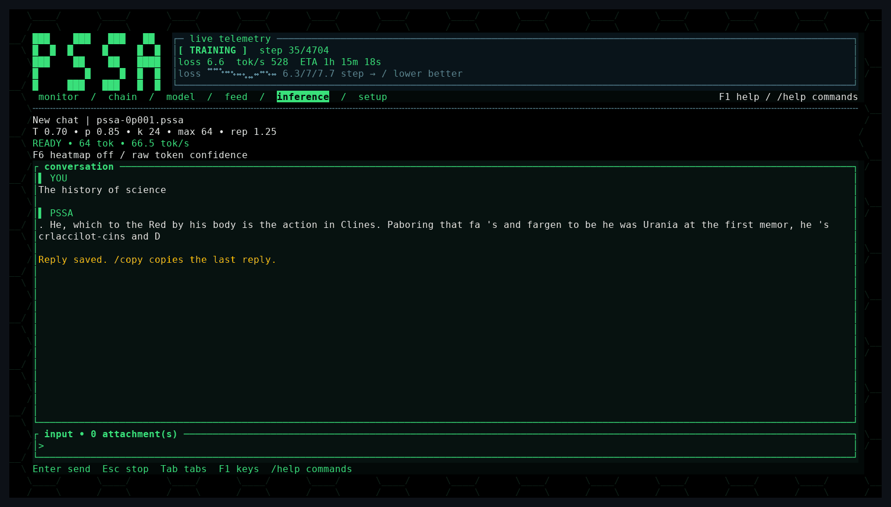
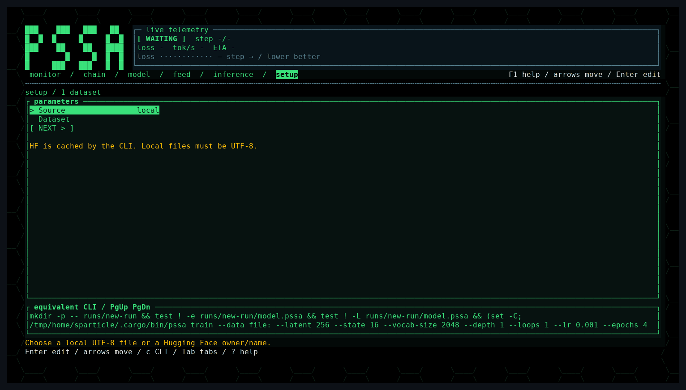
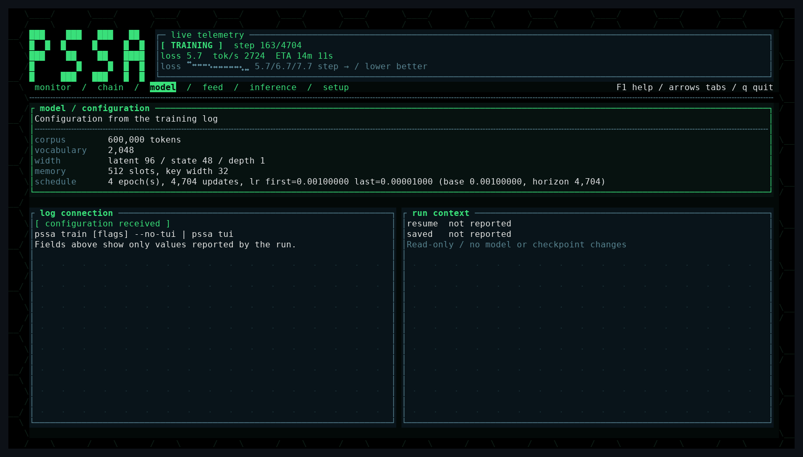
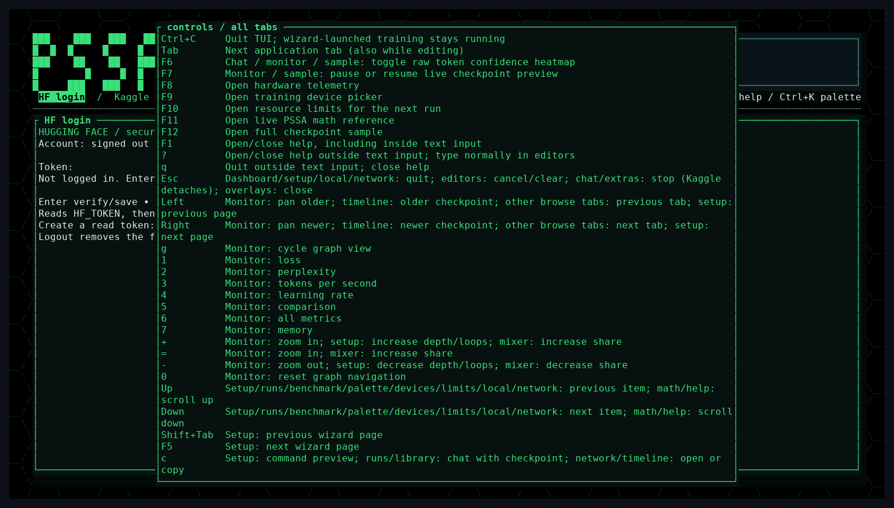

# MSSA

## Memory-augmented state-space architecture

MSSA is an experimental recurrent language-model architecture implemented in
Rust. It combines a selective state-space recurrence, bounded episodic memory
in hyperbolic space, plastic adapters, and a terminal workflow for training,
evaluation, and reproducible benchmarking.

MSSA is maintained as a research fork of
[PSSA (Plastic State-Space Architecture)](https://github.com/Sparticle62ops/pssa),
created by [Sparticle62ops](https://github.com/Sparticle62ops). The active fork is
[NSC64/mssa](https://github.com/NSC64/mssa). The selective recurrence,
episodic memory, plastic adapters, training infrastructure, accelerator
backends, and terminal interface are derived from the upstream implementation.
MSSA extends this foundation with experimental certified sparse inference,
low-bit output-projection research, and forward-only spectral training probes.

MSSA does not use transformer attention or a growing key/value cache. Each
token updates a fixed-size recurrent carry and can read from a bounded memory
bank. This gives inference a constant-size state while still allowing
long-lived episodic information to be stored and retrieved.

> **Compatibility note:** the repository is branded MSSA, while the Rust
> package, executable, checkpoint extension, and several source paths retain
> the historical `pssa` names. The examples use `cargo run --release` and
> therefore do not require an installed executable.



## Design

For a normalized input embedding `x`, MSSA computes token-conditioned recurrence
parameters:

```text
delta = softplus(W_delta x)
B     = W_B x
C     = W_C x
A     = -softplus(A_raw)
```

The diagonal state update is:

```text
A_bar = exp(delta * A)
B_bar = delta * B
h     = A_bar * h + B_bar * x
y     = sum(C * h)
```

The recurrent carry crosses token and chunk boundaries. A memory query combines
the normalized input and current recurrent output:

```text
q  = W_qx x + W_qh y
qh = PoincareProjection(q)
```

The episodic bank stores projected keys and values. Retrieval uses hyperbolic
distance and a temperature-scaled softmax. A learned gate controls how much of
the memory value reaches the residual stream, followed by the plastic adapter
and SiLU MLP.

### Plasticity

- Novel inputs can write new episodic slots.
- Refractory counters prevent repeated contradictory writes from immediately
  erasing stable memories.
- Adapter consolidation transfers a configured fraction of the fast output
  coefficients into a persistent coefficient bank, preserving their effective
  sum up to floating-point rounding.
- Training and inference retain scalar/reference paths so optimized CPU, CUDA,
  and WebGPU paths can be checked against known behavior.

## Certified inference implementation

The implementation contains an opt-in certified inference path developed from
the MSSA research direction:

- `CertifiedMemoryIndex` clusters hyperbolic memory keys and computes a
  conservative omitted-softmax-mass bound.
- If the requested memory certificate cannot be established, retrieval falls
  back to the exact full-bank reader.
- `CertifiedVocabularyIndex` uses centroid/radius bounds to skip vocabulary
  clusters while preserving exact greedy token selection and tie behavior.
- Runtime indexes are not serialized and are invalidated after memory or weight
  updates.

The certified path is an inference optimization. It does not change the
training rule or checkpoint format. The primary implementation is in
[`src/sparse_inference.rs`](src/sparse_inference.rs), with integration in
[`src/pssa.rs`](src/pssa.rs) and generation routing in
[`src/inference.rs`](src/inference.rs).

The five-paired-seed CPU benchmark now measures wall-clock tokens/s and fallback
rates at `V=2048`, width `256`, and `512` populated memory slots. On the small
trained-bank workload, vocabulary-only certification measured `1.442x` paired
speedup, while the dual path measured `1.351x`. CSR fell back on **90.86%** of
queries and was slower alone (`0.943x`). The `2.171x` analytical coordinate-work
proxy is therefore not an observed trained-model speedup. An engineered separated
fixture measured `2.668x`; a diffuse fixture measured `0.884x`.

```bash
cargo run --release -- benchmark --feature sparse --out __agent__/sparse_results
```

See [`docs/MEASURED_RESULTS.md`](docs/MEASURED_RESULTS.md) for paired measurements,
index-build costs, fidelity, and workload limitations.

## BitNet research status

MSSA also contains an opt-in BitNet b1.58 experimental implementation in
[`src/bitnet.rs`](src/bitnet.rs). It uses packed ternary output-head weights
and symmetric per-token int8 activations while keeping recurrent carries,
normalization, and memory values in FP32.

In a local CPU probe using a seeded, randomly initialized model with a
512-token vocabulary and latent width 64, the packed representation was
`12.8x` smaller than the FP32 output weights. Argmax agreement over 128 input
tokens was `44.53%`, and the BitNet/FP32 end-to-end throughput ratio was
`0.448x`. These measurements characterize this probe rather than language-model
quality on a trained checkpoint. The FP32 master weights remain allocated, so
the representation ratio is not a reduction in total process memory.

The experimental path is not enabled by default. Quantization-aware training
(QAT), trained-checkpoint evaluation, and optimized integer kernels are further
research objectives. This implementation was informed by
[BitNet b1.58](https://arxiv.org/abs/2402.17764).

## Interdiffusion research status

Interdiffusion v2 combines local analytic gradients with streaming forward
eligibility and rotating cosine-coordinate updates. It avoids reverse-time
activation tapes; its local gradients, optimizer moments, input tangents, and
fallback probe buffers are explicitly counted. The original pure zeroth-order
spectral optimizer remains available as an ablation.

The five-paired-seed audit uses identical tokenizer IDs, token streams, update
budgets, learning-rate candidates, and warmup/cosine schedules for AdamW and
Interdiffusion. A confidence-gated readout-curvature update improves mean cycle
test CE to `3.08e-15`, versus AdamW's `2.48e-5`; both achieve 100% accuracy.
Mean recall CE is `0.3856` versus `0.3874`. On the tiny held-out byte-text probe,
Interdiffusion achieves CE `3.0102` versus `3.9252`, improving all five pairs.

The measured trade-off is **quality/storage rather than higher training
throughput**: cycle training delivers about `39,332` target tokens/s versus
AdamW's `77,675`. CLI-shape owned numeric storage is `18.86 MiB` versus
`33.83 MiB` (**44.23% less**), counting curvature, gradients, moments, and traces.
Strict loss parity remains incomplete: cycle CE improves in three of five pairs,
and one recall pair misses the 5% final-loss tolerance. The fast eligibility path
applies to depth-one, empty-bank models; populated/stacked models use spectral
probes. Interdiffusion remains an opt-in CPU experiment.

Run the reproducible comparison:

```bash
cargo run --release -- benchmark \
  --feature interdiffusion \
  --out __agent__/interdiffusion_results
```

See [`docs/INTERDIFFUSION.md`](docs/INTERDIFFUSION.md) for the update rule, library
API, state handling, complete protocol, and measured quality/time trade-offs.

## Build and run

### Requirements

- Rust 1.88 or newer (Edition 2024 and let-chain support).
- Cargo.
- Network access only for HTTP or Hugging Face dataset sources.
- For CUDA execution: a build with `--features cuda`, a compatible NVIDIA
  driver, and the required CUDA/cuBLAS runtime libraries.
- Optional speech tools when building with `--features speech`.

Obtain this fork:

```bash
git clone https://github.com/NSC64/mssa.git
cd mssa
```

Build the release binary:

```bash
cargo build --release
# Optional NVIDIA CUDA backend:
cargo build --release --features cuda
```

Run the terminal interface or command help:

```bash
cargo run --release -- tui
cargo run --release -- help
```

## Training

Create an output directory and train on the built-in reference corpus:

```bash
mkdir -p runs
cargo run --release -- train science \
  --tokenizer bpe \
  --max-tokens 200000 \
  --epochs 1 \
  --out runs/model.pssa
```

Train on a local file:

```bash
cargo run --release -- train data/corpus.txt \
  --out runs/model.pssa \
  --epochs 4
```

Resume a long corpus as a sequence of bounded windows:

```bash
cargo run --release -- train data/corpus.txt \
  --skip-tokens 0 --max-tokens 200000 \
  --epochs 1 --out runs/ck01.pssa

cargo run --release -- train data/corpus.txt \
  --skip-tokens 200000 --max-tokens 200000 \
  --resume runs/ck01.pssa --epochs 1 --out runs/ck02.pssa
```

### Token cache and dream replay

Upstream's persistent token cache is opt-in. Reuse `--token-cache PATH` across
corpus windows to avoid retokenizing the full source. Cache contents are
validated against the source fingerprint and tokenizer identity; invalid caches
are rebuilt serially.

```bash
cargo run --release -- train data/corpus.txt \
  --token-cache data/corpus.txt.tok \
  --out runs/model.pssa
```

The experimental sleep phase is also off by default. `--dream-every N` replays
up to `--dream-replay K` occupied entries after every N optimizer updates.
`--dream-mode memory|generate|both` selects stored values, generated sequences,
or both; `--dream-len` controls generated sequence length. Replay currently
updates only the plastic adapters and preserves live recurrent carry. Its
sequential-task probe did not establish reduced forgetting. Dream controls are
runtime-only and must be repeated on resume. GPU runs synchronize weights around
the host-only replay phase.

Important training defaults:

| Option | Default | Meaning |
| --- | ---: | --- |
| `--latent` | `256` | Latent width. |
| `--state` | `16` | Recurrent states per latent channel. |
| `--key` | `32` | Hyperbolic memory-key width. |
| `--memory` | `512` | Episodic memory capacity. |
| `--chunk` | `64` | Training chunk length. |
| `--batch-size` | `1` | Independent document lanes. |
| `--accumulate` | `8` | Chunks per optimizer update. |
| `--lr` | `1e-3` | Base learning rate. |
| `--seed` | `42` | Initialization seed. |
| `--tokenizer` | `bpe` | `bpe` or `word`. |
| `--backend` | `auto` | `auto`, `cpu`, `webgpu`, or `cuda`. |
| `--token-cache` | off | Persistent token-window cache path. |
| `--dream-every` | `0` | Offline replay cadence; zero disables it. |
| `--dream-replay` | `32` | Maximum memory entries/seeds per replay. |
| `--dream-mode` | `memory` | Replay source. |
| `--dream-len` | `64` | Generated tokens per memory seed. |

For bounded divergence containment, the runtime-only options
`--grad-clip 1.0` and `--memory-value-cap 512` can be enabled. Repeat these
options on every resumed run; they are not stored in checkpoints.

## Generation and evaluation

Generate from a checkpoint:

```bash
cargo run --release -- generate \
  --model runs/model.pssa \
  --prompt "The scientist observed" \
  --temperature 0 \
  --max-new-tokens 64
```

Run an interactive chat turn:

```bash
cargo run --release -- chat --model runs/model.pssa
```

Score a checkpoint on a held-out slice:

```bash
cargo run --release -- score data/heldout.txt \
  --model runs/model.pssa \
  --skip-tokens 0 \
  --max-tokens 50000
```

The repository also includes a CPU decoder-only transformer baseline for
comparison:

```bash
cargo run --release -- train-transformer data/corpus.txt \
  --tokenizer-from runs/model.pssa \
  --out runs/baseline.trfm
```

See [`docs/COMPARISON.md`](docs/COMPARISON.md) for the token-matched comparison
workflow.

## Datasets

Training accepts local files, directories, URLs, the built-in `science` corpus,
and Hugging Face repositories:

```bash
cargo run --release -- train data/corpus.txt
cargo run --release -- train data/
cargo run --release -- train https://example.org/corpus.txt
cargo run --release -- train hf:owner/dataset
```

Download a dataset locally:

```bash
cargo run --release -- download wikimedia/wikipedia \
  --out data/wikipedia.txt
```

Clean a raw WikiText text file before starting a new chain:

```bash
cargo run --release -- clean-wikitext \
  wiki.train.raw --out data/wikitext-clean.txt
```

Cleaning writes a new file and never overwrites the input. Do not change the
corpus or cleaning policy halfway through a resume chain because token offsets
would no longer refer to the same data.

## Terminal interface

The TUI provides:

- Training setup and live progress monitoring.
- Local checkpoint chat and streaming generation.
- Memory inspection and retrieval telemetry.
- Held-out evaluation and checkpoint history.
- Hardware/device information and backend selection.
- Dataset library, corpus mixing, sweeps, and run timeline views.

Pipe a headless training run into the dashboard to watch it live:

```bash
cargo run --release -- train data/corpus.txt \
  --out runs/ck001.pssa --backend cpu --no-tui \
  | target/release/pssa tui --chain runs
```

**Monitor:** loss, speed, ETA, optimizer progress, and memory occupancy.
Press `g` or `1`–`7` to switch graphs and `+`/`-` to zoom. Graph `7` plots
occupied episodic slots on the Poincare disk.




**Inference:** chat with checkpoints; `/model PATH` loads one, and `/temp`,
`/top-p`, `/top-k`, `/max-tokens`, and `/repetition-penalty` change sampling.
`/ab` compares MSSA with the transformer baseline; `F6` colors token confidence.



**Setup:** the wizard selects the dataset, model, depth/loops, schedule, and
backend, and displays the equivalent CLI command. Model, chain, and feed views
show the run configuration, checkpoints, and streamed training tokens.




Press `Tab` to change views and `Ctrl+K` to open the command palette. `F8` shows
hardware telemetry, `F9` selects the device, `F10` sets resource limits, and
`F11` opens the math reference. `F1` or `?` shows keyboard help.



See:

- [`docs/training-setup.md`](docs/training-setup.md)
- [`docs/TUI-EXTRAS.md`](docs/TUI-EXTRAS.md)
- [`docs/STACKED-DEPTH.md`](docs/STACKED-DEPTH.md)

## Benchmarks

Run the deterministic feature benchmark suite:

```bash
cargo run --release -- benchmark \
  --feature all \
  --out __agent__/feature_results
```

Run one feature:

```bash
cargo run --release -- benchmark \
  --feature bitnet \
  --out __agent__/bitnet_results
```

Benchmark records are JSON files with a generated `summary.md`. Timing reports
should identify the model configuration, backend, hardware, and workload.
Accelerator measurements require execution on the corresponding device.

## Development

For repeated local edits, use the optimized incremental `fast` profile:

```bash
cargo check --profile fast --tests
cargo build --profile fast
cargo test --profile fast
cargo run --profile fast -- help
# Optional NVIDIA CUDA backend:
cargo build --profile fast --features cuda
```

This profile enables incremental compilation, disables LTO, and uses 16 codegen
units while retaining optimization level 3. Its binaries and compiler cache live
under `target/fast/`. The first build populates the cache; subsequent edits can
reuse it. Debug builds (`cargo build`) already enable incremental compilation.
Keep using the normal release profile for reproducible performance measurements.

Run the release tests:

```bash
cargo test --release
```

Check all test targets without running them:

```bash
cargo check --release --tests
```

The scalar CPU implementation is the reference for numerical checks. Optimized
CPU, CUDA, WebGPU, batched, stacked-depth, and shared-loop paths should preserve
the reference behavior within the tolerances covered by the test suite.

## Checkpoints and compatibility

The current model checkpoint extension is `.pssa`; transformer baseline files
use `.trfm`. Checkpoints include model weights, tokenizer metadata, optimizer
state, recurrent state, episodic memory, and schedule information as applicable.
Runtime-only sparse indexes and quantized inference caches are not serialized;
applications must explicitly enable and rebuild them after loading.

Checkpoint repair and compatibility tests live in
[`tests/checkpoint_repair.rs`](tests/checkpoint_repair.rs).

## Repository layout

| Path | Purpose |
| --- | --- |
| `src/pssa.rs` | MSSA model, recurrence, memory integration, plasticity, and training. |
| `src/memory.rs` | Hyperbolic episodic memory bank. |
| `src/dream.rs` | Experimental offline replay modes and summaries. |
| `src/token_cache.rs` | Validated persistent token windows and serial cache construction. |
| `src/wgpu_stages.rs` | WebGPU recurrent scan and memory training stages. |
| `src/sparse_inference.rs` | Certified memory and vocabulary inference indexes. |
| `src/sparse_benchmark.rs` | Paired wall-clock throughput, certificate fallback, and fidelity measurements. |
| `src/bitnet.rs` | Experimental packed ternary inference primitives. |
| `src/interdiffusion.rs` | Weight-only CPU runtime and forward-only spectral optimizer. |
| `src/interdiffusion_adaptive.rs` | Tape-free hybrid trainer, local readout learning, and probe fallback. |
| `src/interdiffusion_eligibility.rs` | Streaming recurrent/local derivatives and cosine-coordinate updates. |
| `src/interdiffusion_input_eligibility.rs` | Bounded embedding-row and normalization tangents. |
| `src/interdiffusion_benchmark.rs` | Isolated from-scratch learning comparisons. |
| `src/inference.rs` | Generation and sampling APIs. |
| `src/feature_benchmark.rs` | Deterministic feature benchmarks. |
| `src/tui/` | Terminal interface. |
| `scripts/tui_audit_pty.py` | Isolated headless terminal audit driver. |
| `tests/` | Numerical, checkpoint, backend, and interface tests. |

## Project status

MSSA is a research prototype. The certified sparse inference path is covered by
exactness and fallback tests. BitNet post-training quantization compresses the
output-head representation while retaining FP32 master weights; it does not meet
the quality or performance requirements for a default path. Larger-scale training,
research-specific datasets, and real accelerator measurements remain future work.
Interdiffusion v2 improves the measured CPU memory/recall-quality trade-off, with
strict per-seed parity and broader training quality still research objectives.

Upstream's WebGPU recurrent and memory training stages are integrated, including
packed document lanes. Small CPU/WebGPU forward and gradient parity tests and
training-shape dispatch checks pass on an NVIDIA GeForce 940MX; corpus-scale
training and accelerator throughput remain unmeasured. Software adapters are
refused by default. Dream replay is experimental, off by default, and currently
limited to adapter updates. Text quality at this prototype scale remains poor.

## Attribution and community

The original PSSA architecture and implementation are credited to
[Sparticle62ops and upstream contributors](https://github.com/Sparticle62ops/pssa/graphs/contributors).
Historical upstream results are documented in the
[PSSA repository](https://github.com/Sparticle62ops/pssa); they should be evaluated
under their reported configurations and protocols.

- MSSA issues and contributions: [NSC64/mssa](https://github.com/NSC64/mssa/issues).
- Upstream source and documentation: [Sparticle62ops/pssa](https://github.com/Sparticle62ops/pssa).
- Upstream PSlabs community: [Discord](https://discord.gg/9sqfKeqWYF).

The upstream project's published Solana support address is
`4XPZ9uAa2BMoth6msoHRxTWL4mUrMfq3LGrxbAGja96h`.

## License

MSSA is distributed under the GPL-3.0-or-later license.
